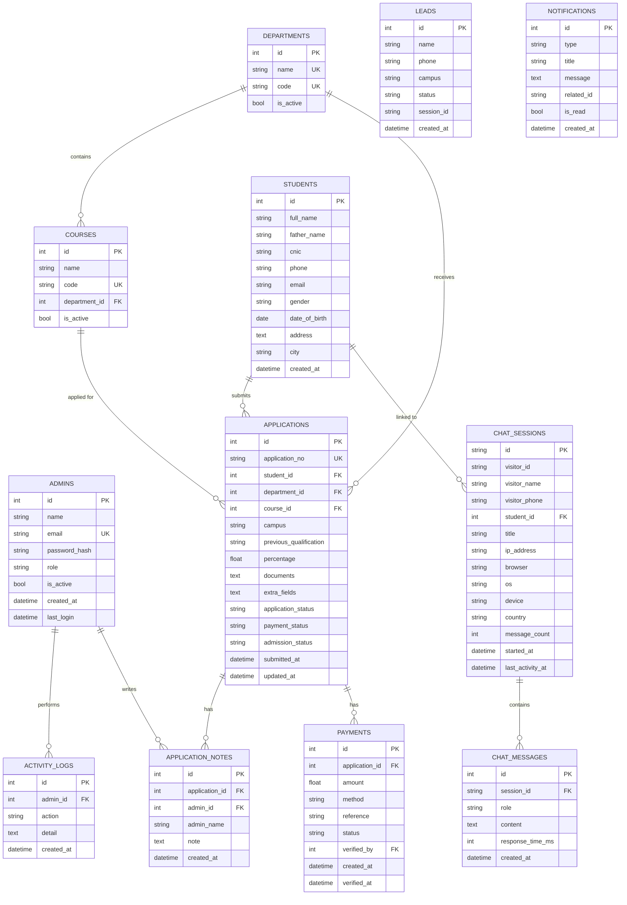

# Database schema

Normalised relational schema (SQLAlchemy 2.0). Works identically on SQLite
(default, `brains_college.db`) and PostgreSQL (`DATABASE_URL`). All timestamps
are stored as naive local time in the configured `TIMEZONE` (default
`Asia/Karachi`), which keeps "today / this month" analytics correct for the
college.

## Tables

| Table | Purpose |
|---|---|
| `admins` | Dashboard accounts (`super_admin` / `admin` / `staff`) |
| `activity_logs` | Audit trail: logins, status changes, exports |
| `departments`, `courses` | Academic catalogue (course → department) |
| `students` | One row per student (deduplicated by CNIC, then phone) |
| `applications` | Admission forms; `APP-{year}-{00001}` numbers; 3 status tracks |
| `application_notes` | Admin remarks on an application |
| `payments` | Fee records; verification creates a notification |
| `chat_sessions` | One row per conversation (visitor fingerprint, device, browser, OS, IP, country, title, counters) |
| `chat_messages` | Every user/assistant message; `response_time_ms` for AI latency stats |
| `leads` | Quick chatbot enquiries (name + phone + campus) — formerly Google Sheets |
| `notifications` | Smart alerts — unique `hash` blocks duplicates; `occurrences` counts merged repeats; category + priority |
| `challans` | Fee challans: `CH-{year}-{00001}`, amount, due date, PDF path, portal `access_token` |
| `payment_receipts` | Uploaded payment proofs (file, unique transaction id, verifier, remarks) — never deleted |
| `lead_notes` | Staff remarks on leads |
| `installments` | Per-application fee ledger (amount, due date, status, paid amount) — the source of truth for all fee numbers, statuses and class eligibility |

Indexes cover every column used in filters, search, sorting and joins
(phones, CNIC, statuses, timestamps, foreign keys, `visitor_id`), so lists
stay fast with 10k+ students and 100k+ messages; all list endpoints paginate.

## ER diagram

## Status values

- `applications.application_status`: `pending` → `approved` / `rejected` / `on_hold`
- `applications.payment_status` (auto): `unpaid` (red) → `partially_paid` (yellow) → `fully_paid` (green)
- `applications.eligibility_status` (auto): `not_eligible` → `eligible` (paid ≥ 75%)
- `applications.admission_status`: `not_admitted` → `admitted` → `enrolled`
- `leads.status`: `new` → `contacted` → `converted` / `closed`

## How chats link to students (Part 9)

1. A visitor chats → a `chat_sessions` row is created (anonymous fingerprint).
2. They submit the in-chat lead form → `visitor_name` / `visitor_phone` are
   stored on the session.
3. When an admission application arrives with the **same phone number**, every
   matching session is adopted (`student_id` set) automatically — the
   application detail page then shows the full chat history. Admins can also
   link sessions manually from the "Possible matches" list.

## New columns (this upgrade)

- `students.roll_number` — unique primary identifier (backfilled as `R-{id}` for
  pre-existing rows on first startup).
- `applications.programme_category`, `applications.course_name` — two-level
  programme selection (catalog-driven, independent of the legacy courses table).
- `applications.session`, `applications.class_timing` (in `extra_fields`),
  `applications.assigned_staff_id/name`, `applications.remarks`.
- `applications.lead_source`, `applications.lead_source_detail` — marketing source.
- `payments.receipt_number`, `installments.receipt_number` — required on approval.

## Multi-campus columns (this upgrade)

- `admins.campus` — the campus an admin is limited to; empty = super admin
  (college-wide). Four campus admins are seeded automatically.
- `expenses.campus`, `budgets.campus` — each campus tracks its own spending and
  budgets. `budgets.category` is **no longer globally unique** (unique per
  campus instead), so two campuses can each have an "Equipment" budget.
- `chat_sessions.campus` — a conversation is tagged with a campus when the
  visitor submits the chatbot lead form, so conversations split by campus.
- `applications.campus` and `leads.campus` already existed and are now used for
  per-campus scoping across every list, dashboard, chart and export.

All of these are added automatically by the additive migration on first boot;
existing rows keep an empty campus (visible to the super admin) until edited.
